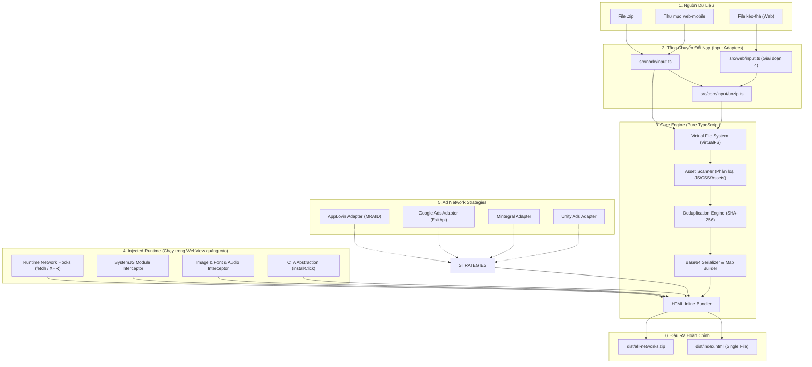

# 🎓 Đề Cương Khoá Học: Xây Dựng Playfuse Build Tool

> **Môn học:** Kỹ thuật Xây dựng Công cụ Build (Build Tooling Engineering)  
> **Đồ án cuối khoá:** `Playfuse` — Công cụ chuyển đổi bản build `web-mobile` từ Cocos Creator (3.x) thành **1 file HTML duy nhất** tương thích với các Ad Network hàng đầu (AppLovin, IronSource, Mintegral, Unity, Google...).  
> **Ngôn ngữ & Môi trường:** TypeScript (Node.js 20+ ESM, sau đó chuyển dịch sang Browser / Web Worker).

---

## 📌 Phương Pháp Đào Tạo & Tiêu Chuẩn Nộp Bài

1. **Cấu trúc mỗi bài học:**
   - 📖 **Lý thuyết nền tảng:** Đi sâu vào nguyên lý trình duyệt, runtime engine, hoặc design pattern liên quan trước khi bắt tay vào code.
   - 🎯 **Yêu cầu bài tập (Workload & Deliverables):** Danh sách task, interface định nghĩa rõ ràng.
   - ✅ **Tiêu chí nghiệm thu (Acceptance Criteria):** Điều kiện bắt buộc để pass bài tập (test case, lint, benchmark).
   - 💡 **Gợi ý & Câu hỏi tư duy:** Định hướng suy nghĩ kiến trúc, không đưa sẵn code giải pháp.
2. **Quy trình nộp bài:**
   - Bạn tự đảm nhận viết code và unit test trong repo.
   - Khi hoàn thành, thông báo: `"Nộp bài X"`.
   - Giảng viên sẽ review chi tiết code, chạy test suite, kiểm tra edge case và chấm điểm theo Rubric (Cần đạt **≥ 8/10** để mở khoá bài tiếp theo).

### Thang Điểm Rubric (10 điểm)

| Tiêu chí | Điểm | Ý nghĩa & Tiêu chuẩn |
|---|:---:|---|
| **Chức năng (Functionality)** | 4.0 | Đạt 100% tiêu chí nghiệm thu và pass tất cả test cases (kể cả edge cases). |
| **Kiến trúc & Phân tầng (Architecture)** | 2.0 | Tuân thủ Dependency Rule (Core không dính Node/DOM, Runtime độc lập, Node/Web là adapter). |
| **An toàn Kiểu (Type Safety)** | 1.5 | Không dùng `any`, không ép kiểu `as` vô căn cứ, tận dụng Discriminated Unions và Type Guards. |
| **Kiểm thử (Automated Tests)** | 1.5 | Có unit test bao phủ các nhánh logic chính và trường hợp biên (edge cases). |
| **Chất lượng Code (Clean Code)** | 1.0 | Đặt tên rõ nghĩa, xử lý lỗi có hệ thống, JSDoc giải thích nguyên do (Why thay vì What). |

---

## 🗺️ Lộ Trình & Khối Lượng Công Việc Chi Tiết Từng Bài

### Module 0: Nền Tảng & Thiết Lập Dự Án (Giai đoạn 1)

#### [Đã xong] Bài 0: Playable Ads & Giải Phẫu Bản Build Cocos 3.x
- **Mục tiêu:** Hiểu rõ 5 "cửa" nạp tài nguyên của trình duyệt (`` và kỹ thuật escaping `<\/script>`.
- **Khối lượng công việc:**
  - Đọc `index.html` gốc, thay thế các thẻ `<link rel="stylesheet">` bằng thẻ `<style>` inline.
  - Nhúng bảng `window.__assetsMap__` và đoạn code Runtime Hooks vào đầu thẻ `<head>`.
  - Nhúng các Engine Scripts và Game Scripts vào các thẻ `<script>` inline theo đúng thứ tự phụ thuộc.
  - Thực hiện escape an toàn toàn bộ nội dung script nhúng inline.
- **Nghiệm thu:** Tạo ra file `output.html` duy nhất, cú pháp HTML hợp lệ, kích thước chuẩn xác.

#### Bài 9: Hoàn Thiện CLI & Kiểm Thử E2E Trình Duyệt Thật
- **Lý thuyết:** Xây dựng Command-line Interface thân thiện; Logging và ProgressBar; Tự động hoá kiểm thử E2E không đầu (Headless Browser) với Playwright / Puppeteer.
- **Khối lượng công việc:**
  - Viết CLI hoàn chỉnh `playfuse build <input> -o <output.html>`.
  - Viết test E2E: Dùng Playwright mở trực tiếp file `output.html` qua giao thức `file:///`.
  - Bắt console log của Cocos: Đảm bảo game chuyển sang trạng thái `start()`, canvas render frame đầu tiên, không có lỗi mạng (404/CORS).
- **Nghiệm thu:** File HTML độc lập mở bằng `file://` trên trình duyệt thật chạy hoàn hảo.

---

### Module 5: Ad Network Adapters (Giai đoạn 3 — Strategy Pattern)

#### Bài 10: Lớp Trừu Tượng CTA & Strategy Pattern
- **Lý thuyết:** Strategy Design Pattern; Vấn đề phân mảnh API quảng cáo; Lớp trừu tượng hoá hành vi Call-To-Action (CTA).
- **Khối lượng công việc:**
  - Định nghĩa interface `AdNetworkAdapter` với các phương thức: `injectHead()`, `injectBody()`, `wrapCTA()`.
  - Thiết kế API chung cho developer game: `window.installClick()`.
  - Tạo `NetworkRegistry` quản lý các adapter theo tên.
- **Nghiệm thu:** Type-check strict các adapter, hỗ trợ cấu hình động qua tham số CLI.

#### Bài 11: Hiện Thực Adapter Từng Mạng & Batch Build
- **Lý thuyết:** SDK specs của AppLovin (MRAID v2/v3), Google Ads (ExitApi), Mintegral (gameStart/gameClose), Unity Ads, IronSource.
- **Khối lượng công việc:**
  - Viết adapter cho:
    - `AppLovin / IronSource`: Nhúng `mraid.js` và xử lý `mraid.open(storeUrl)`.
    - `Google Ads`: Nhúng metadata và gọi `ExitApi.exit()`.
    - `Mintegral`: Tích hợp `window.install()` và xử lý pause/resume âm thanh.
  - Bổ sung tuỳ chọn CLI `--network=applovin|google|mintegral|all`. Khi chọn `all`, tự động xuất từng file HTML tương ứng vào thư mục `dist/`.
- **Nghiệm thu:** Kiểm tra file output của từng network tuân thủ đúng tài liệu kỹ thuật của mạng quảng cáo đó.

---

### Module 6: Web UI Kéo - Thả Trên Trình Duyệt (Giai đoạn 4)

#### Bài 12: Đẳng Cấu Hoá Core Engine & Web Worker
- **Lý thuyết:** Isomorphic / Universal JavaScript; Giới hạn của Main Thread khi xử lý file lớn (UI blocking); Giao tiếp qua lại với Web Worker (`postMessage`, `Transferable Objects`).
- **Khối lượng công việc:**
  - Tách rời hoàn toàn các adapter đọc file đĩa của Node.js, cung cấp adapter trên Web sử dụng `File` / `Blob` API.
  - Đóng gói toàn bộ luồng Build Tool chạy ngầm trong Web Worker để giao diện không bị giật lag khi xử lý file nặng.
- **Nghiệm thu:** Core build chạy trơn tru 100% trong môi trường Browser mà không gọi bất kỳ Node API nào.

#### Bài 13: Xây Dựng Giao Diện Kéo - Thả (Dropzone & Live Preview)
- **Lý thuyết:** UX cho công cụ Developer; Sandboxing `<iframe>` để preview game an toàn; Theo dõi tiến độ build và kích thước file trực quan.
- **Khối lượng công việc:**
  - Xây dựng giao diện hiện đại: Dropzone kéo thả file `.zip`, danh sách checkbox Ad Network, thanh đo dung lượng (Size Inspector).
  - Tích hợp khung `<iframe>` sandbox cho phép chơi thử game và test nút CTA ngay tại chỗ sau khi đóng gói.
  - Tải về file `.html` đơn lẻ hoặc gói `.zip` chứa toàn bộ biến thể mạng quảng cáo.
- **Nghiệm thu:** Ứng dụng web hoạt động hoàn chỉnh độc lập trên trình duyệt client-side.

---

### Module 7: Tối Ưu Dung Lượng & Hiệu Năng (Giai đoạn 5)

#### Bài 14: Asset Deduplication (Chống Trùng Lặp) & Nén Ảnh Tích Hợp
- **Lý thuyết:** Hash cryptographic (SHA-256) xác định trùng lặp nội dung; Tối ưu dung lượng Payload Base64; Tích hợp module nén nhị phân native / Wasm.
- **Khối lượng công việc:**
  - Tính SHA-256 cho toàn bộ asset; Nếu nhiều đường dẫn trỏ đến nội dung giống nhau, chỉ lưu 1 bản Base64 duy nhất trong `__assetsMap__`, các đường dẫn khác chỉ là tham chiếu alias.
  - Tích hợp công cụ nén ảnh `tiny-png` (Rust) qua CLI wrapper hoặc build Wasm để tối ưu hoá texture trước khi đưa vào bundle.
- **Nghiệm thu:** Giảm dung lượng file output cuối cùng thêm 15% - 40% trên các project có nhiều asset lặp lại.

---

## 🏛️ Sơ Đồ Kiến Trúc Toàn Hệ Thống

